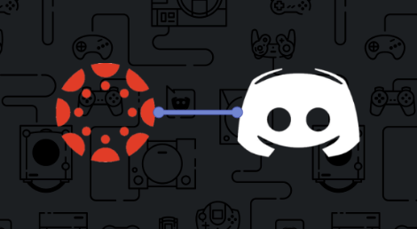

# canvas-discord-bot

<br />
<p align="center">
  <a href="https://github.com/Dedas/canvas-discord-bot">
    
  </a>

  <h3 align="center">Canvas Discord Bot</h3>

  <p align="center">
    This is a discord bot that gets information about courses and announcements from Canvas API and sends this information in a discord channel.
    <br />
    <br />
    <a href="https://github.com/Dedas/canvas-discord-bot/issues">Report Bug</a>
    ·
    <a href="https://github.com/Dedas/canvas-discord-bot/issues">Request Feature</a>
  </p>
</p>
<!-- PROJECT LOGO -->

<!-- TABLE OF CONTENTS -->
<details open="open">
  <summary><h2 style="display: inline-block">Table of Contents</h2></summary>
  <ol>
    <li>
      <a href="#about-the-project">About The Project</a>
      <ul>
        <li><a href="#built-with">Built With</a></li>
      </ul>
    </li>
    <li>
      <a href="#getting-started">Getting Started</a>
      <ul>
        <li><a href="#prerequisites">Prerequisites</a></li>
        <li><a href="#installation">Installation</a></li>
        <li><a href="#usage">Usage</a></li>
      </ul>
    </li>
    <li><a href="#commands">Commands</a></li>
    <li><a href="#make-your-own-command">Make Your Own Command?</a></li>
    <li><a href="#contributing">Contributing</a></li>
    <li><a href="#license">License</a></li>
    <li><a href="#contact">Contact</a></li>
    <li><a href="#acknowledgements">Acknowledgements</a></li>
  </ol>
</details>

<!-- ABOUT THE PROJECT -->
## About The Project
We are a group of students studying at Gothenburg University who decided that we wanted to build a bridge between Canvas LMS and Discord. The result is a bot that can recieve and post announcements made by, for example, teachers in a Discord channel.

### Built With

* [discord.py](https://discordpy.readthedocs.io/en/latest/index.html)
* [Discord Developer](https://discord.com/developers/applications)
* [Canvas API](https://canvas.instructure.com/doc/api/)
* [SQLite](https://www.sqlite.org/index.html)
* [Python](https://www.python.org/)

<!-- GETTING STARTED -->
## Getting Started

Below you will find the steps to get started with the bot.

### Prerequisites

* Download the latest version of [Python](https://www.python.org/)
* Create a [discord bot](https://discordpy.readthedocs.io/en/latest/discord.html) and invite it to your [discord channel](https://support.discord.com/hc/en-us/articles/204849977-How-do-I-create-a-server-)
* Create a [Canvas API access token](https://community.canvaslms.com/t5/Admin-Guide/How-do-I-manage-API-access-tokens-as-an-admin/ta-p/89) as an admin or regular user (if you domain permits it).

### Installation
1. Clone the repository

   ```sh
   git clone https://github.com/Dedas/canvas-discord-bot
   ```
2. Navigate into your cloned folder

   ```sh
   cd "Drive:/folder/folder/canvas-discord-bot"
   ```
3. Install the following modules:

   ```sh
   pip install requests
   pip install environs
   pip install apscheduler
   pip install discord
   pip install BeautifulSoup
   ```

<!-- USAGE EXAMPLES -->
## Usage

To use the bot you need to fill in some parameters in the .env file.

1. Rename the .env.example file to .env
2. In the .env file, replace the text with your parameters </br>
   
    *Make sure that the Canvas Token has access to all the availible courses!*

    ```sh
    DISCORD_TOKEN='https://discord.com/developers/applications'
    CANVAS_TOKEN='YOUR CANVAS TOKEN'
    CANVAS_DOMAIN='YOUR CANVAS DOMAIN'
    CHANNEL_ID='YOUR DISCORD CHANNEL_ID'
    ```
3. Run the bot

    ```sh
    python bot.py
    ```

    With debug messages on:

    ```sh
    python bot.py -d
    ```
<!-- COMMANDS -->
## Commands

- `.courses` - List all the courses that the bot has access to.
- `.subscribe <course_id>` - Subscribing to a course and recieve announcements from that course.

<!-- LICENSE -->
## License

<!-- CONTACT -->
## Contact

Andreas Winkler - guskalinan@student.gu.se | [LinkedIn](https://www.linkedin.com/in/andreas-winkler-970335107/)

Tove Andersson - gusandtocs@student.gu.se | [LinkedIn](https://www.linkedin.com/in/tove-andersson-75ab83165/)

Josef Gunnarsson - gusgunjoae@student.gu.se

<!-- ACKNOWLEDGEMENTS -->
## Acknowledgements

We have been inspired by:
* [NxT-Media-Technology](https://github.com/NxT-Media-Technology/Canvas-Student-Announcement-Discord-Bot)